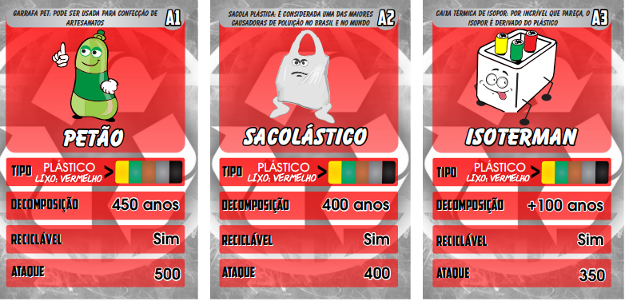

<h1 align="center"></h1>

<p align="center">
 <a href="#tech">Authors</a> • 
 <a href="#clone">Clone</a> • 
 <a href="#contribute">Contribute</a> •
 <a href="#license">License</a>
</p>

<p align="center">
<b>This is a game two players top trump and its theme is recycling. The initial player will be random chosen on the first round, after that, each player will receive randomly 16 cards, each round the player who won the last round will choose one of the attributes of his first card of his card deck that he would like to compare with the card of the other player and the winner will be set based on the comparison result. The winner will receive the other player card and both cards of the round will be added at the end of winner card deck. Whoever gets all the cards first wins the game</b>
</p>
<p align="center">
   
   
   
</p>


<h2 id="tech">Technologies</h2>

- Java

- Java API for reading CSV files

<h2 id="clone">Clone</h2>

```
git clone https://github.com/Fernanda-Kipper/top-trumps-game.git
```

<h4> Prerequisites</h4>

- JDK >= 11.0.0 < 12.0.0

<h2 id="contribute">Contribute 🚀</h2>

If you want to contribute, clone this repo, create your work branch and get your hands dirty!

```bash
git clone https://github.com/Fernanda-Kipper/top-trumps-game.git
git checkout -b feature/NAME
```

 At the end, open a Pull Request explaining the problem solved or feature made, if exists, append screenshot of visual modifications and wait for the review!

[How to create a Pull Request](https://www.atlassian.com/br/git/tutorials/making-a-pull-request)

[Commit pattern](https://gist.github.com/joshbuchea/6f47e86d2510bce28f8e7f42ae84c716)


<h2 id="license">License 📃 </h2>

This project is under [MIT](LICENSE) license


